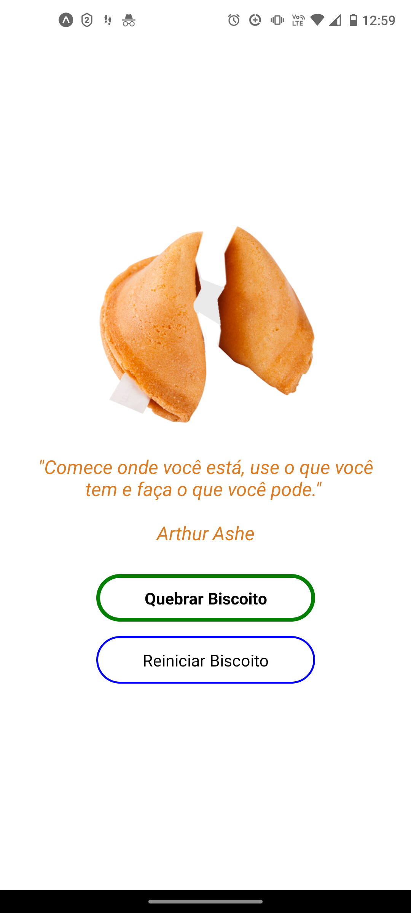

# Biscoito da Sorte


Este é um aplicativo _mobile_ desenvolvido com _React Native_ que mostra a imagem de um biscoito, o qual, ao ser 'quebrado', exibe aleatoriamente uma frase motivacional. O usuário pode 'reiniciar' o biscoito para exibir novamente a imagem original.

## Índice

- <a href="tecnologias">Tecnologias Utilizadas<a/>
- <a href="rodar-app">Como rodar este App<a/>
- <a href="aparencia">Aparência e Funcionalidade<a/>
- <a href="contato">Contato<a/>

## Tecnologias Utilizadas

1. [Node.js](https://nodejs.org/en)

2. [React Native (Expo-CLI)](https://reactnative.dev/docs/environment-setup)

3. [Expo Go](https://play.google.com/store/apps/details?id=host.exp.exponent&hl=pt_BR&gl=US&pli=1)

## Como rodar este App

### Comandos Bash

```bash
# Clone o repositório:
$ git clone "link-deste-repositorio"

# Abra o terminal na pasta do projeto:
$ cd biscoito-da-sorte

# Instale o:
[Node.js](https://nodejs.org/en)

# Verifique se o _Node.js_ foi instalado corretamente, se sim, aparecerá a respectiva versão:
$ node -v

# Certifique-se de ter o _Expo CLI_ instalado em sua máquina. Caso não tenha, execute:
$ npm install -g expo-cli

# Inicie o projeto:
$ npx expo start

# Com o _Expo Metro Bundler_ aberto, escolha a opção desejada para rodar o aplicativo em um emulador, dispositivo físico ou na _web_.

# Caso opte por rodar o aplicativo em um dispositivo físico, certifique-se de que esteja conectado à mesma rede _Wi-Fi_ do _PC_, e, o _Expo Client_ instalado no dispositivo. Para rodar o aplicativo, abra o _Expo Client_ e escaneie o _QR Code_ que será exibido no _Expo Metro Bundler_.

```

## Aparência e Funcionalidade



## Contato


[Linkedin](https://www.linkedin.com/in/adalto-prado-devjr)
